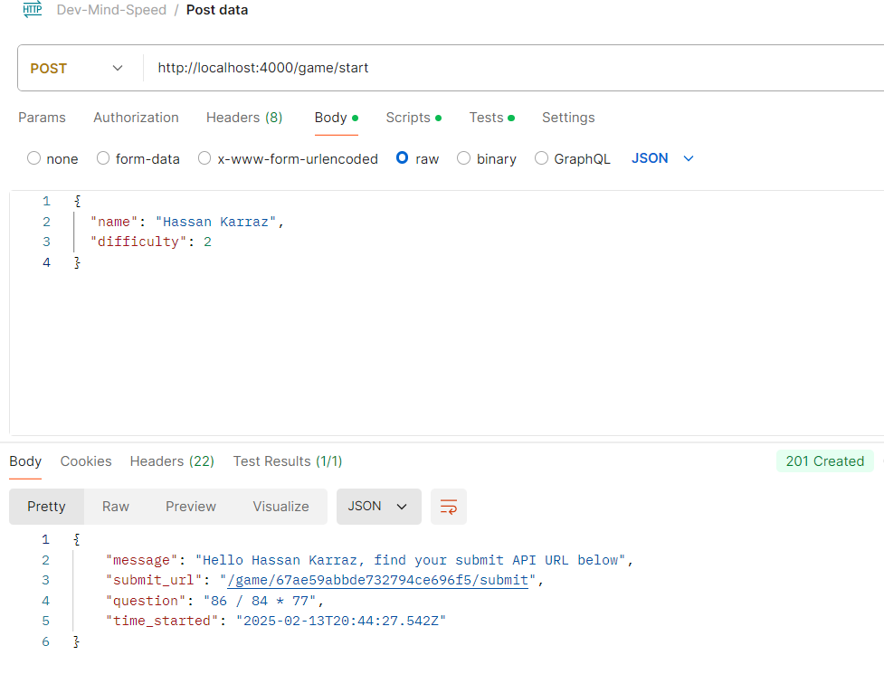
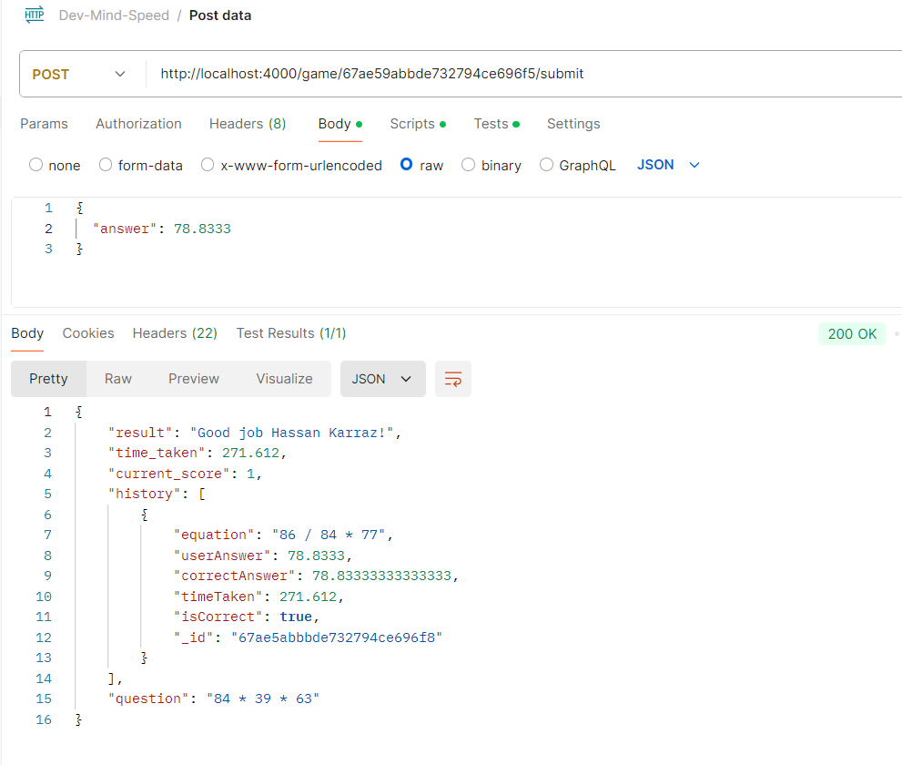
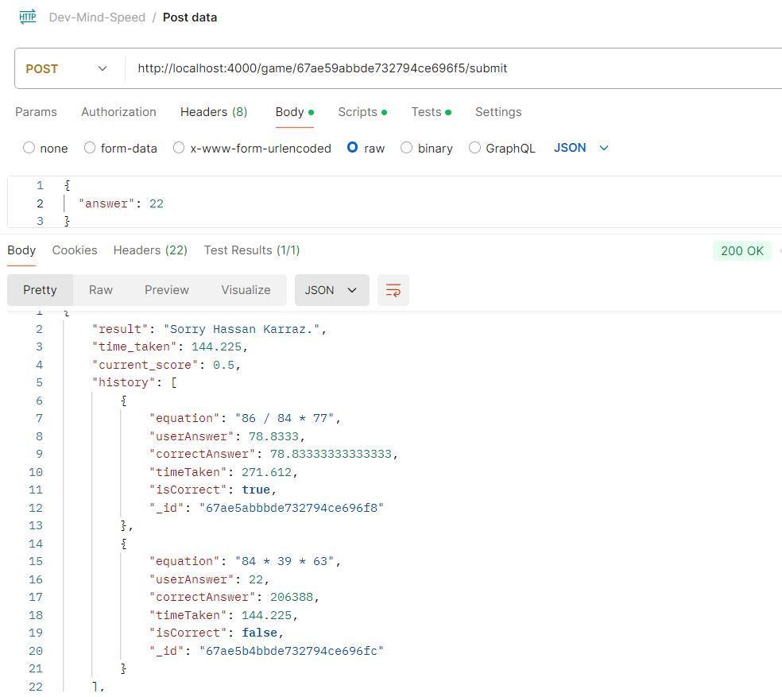
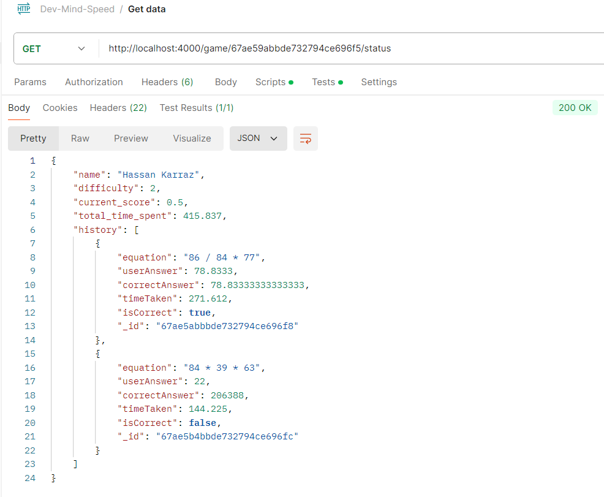

# Dev-Mind-Speed

## Overview

**Dev Mind Speed** is a backend-based math game designed to test players' speed and accuracy in solving math equations through API calls. Built with Node.js, Express, and TypeScript. Integrated with a MongoDB database to manage game sessions, questions, and responses.

## Features

- Start a new game with a customizable difficulty level.
- Submit answers to math equations and get instant feedback.
- Track game status, including scores and history.
- Secure API with request validation and proper error handling.
- Built-in unit tests for automated testing of endpoints.

## Packages and Technologies Used

- **Node.js**: Runtime environment for JavaScript.
- **TypeScript**: Adds static typing for maintainable code.
- **Express.js**: Framework for building REST APIs.
- **MongoDB**: NoSQL database for storing game data.
- **dotenv**: Manages environment variables.
- **express-validator**: Validates incoming request data.
- **express-rate-limit**: Protects against brute-force attacks.
- **helmet**: Secures HTTP headers.
- **mathjs**: Generates random math equations.
- **ts-node-dev**: Provides a TypeScript development environment.
- **Jest** & **Supertest**: Enable unit and integration testing.

## Setup and Usage

### Prerequisites

- Install [Node.js](https://nodejs.org/) (v16 or higher).
- Install [MongoDB](https://www.mongodb.com/).

### Installation

1. Clone the repository:

   ```bash
   git clone https://github.com/Hassan-Ayman-SE/Dev-Mind-Speed.git
   cd Dev-Mind-Speed

   ```

2. Install dependencies:

   ```bash
   npm install

   ```

3. Configure environment variables:

   - Create a .env file in the root directory and set the following:

   ```bash
   MONGO_URI=mongodb://localhost:27017/dev-mind-speed-db
   PORT=4000

   ```

4. Build the project:

   ```bash
   npm run build

   ```

5. Start the server:
   ```bash
   npm start
   ```

### Development Mode

- To run in development mode:
  ```bash
  npm run dev
  ```

### Testing

- Run unit and integration tests:
  ```bash
  npm test
  ```

## API Endpoints

1. Start a New Game

   - POST /game/start

   Request Body:

   ```json
   {
     "name": "Hassan Karraz",
     "difficulty": 2
   }
   ```

   Response:

   ```json
   {
     "message": "Hello Hassan Karraz, find your submit API URL below",
     "submit_url": "/game/{game_id}/submit",
     "question": "45 + 32 - 20",
     "time_started": "2025-02-13T10:00:00Z"
   }
   ```

2. Submit an Answer

   - POST /game/{game_id}/submit

   Request Body:

   ```json
   {
     "answer": 57
   }
   ```

   Response:

   ```json
   {
     "result": "Good job Hassan Karraz, your answer is correct!",
     "time_taken": 8,
     "current_score": "1/1",
     "history": [
       {
         "question": "45 + 32 - 20",
         "answer": 57,
         "time_taken": 8,
         "correct": true
       }
     ]
   }
   ```

3. Get Game Status

   - GET /game/{game_id}/status

   Response:

   ```json
   {
     "name": "Hassan Karraz",
     "difficulty": 2,
     "current_score": "1/1",
     "total_time_spent": 8,
     "history": [
       {
         "question": "45 + 32 - 20",
         "answer": 57,
         "time_taken": 8,
         "correct": true
       }
     ]
   }
   ```

## Testing Routes with Postman

### 1. Start a New Game (POST /game/start)



### 2. Submit Answer (POST /game/{game_id}/submit)

question 1:

question 2 with history:


### 3. Get Game Status (GET /game/{game_id}/status)



## Unit Testing

The project includes unit tests to ensure endpoints function as expected. Tests are written using Jest and Supertest, covering:

- Request validation
- Game logic correctness
- Database integration

Run tests with:

```bash
npm test
```

## Design Decisions and Trade-offs

1. **TypeScript**:

   - Improves code reliability with static typing
   - Enhances maintainability in large codebases
   - Enables catching errors during development

2. **MongoDB**:

   - Chosen for its flexibility in managing dynamic data structures such as game sessions and history

3. **Express.js**:

   - Provides a lightweight and extensible framework for building REST APIs

4. **Security**:

   - Request validation using `express-validator`
   - Integrated `helmet` for HTTP security headers
   - Implemented `express-rate-limit` to mitigate brute-force attacks

5. **Testing**:
   - Added automated unit tests for better quality assurance
